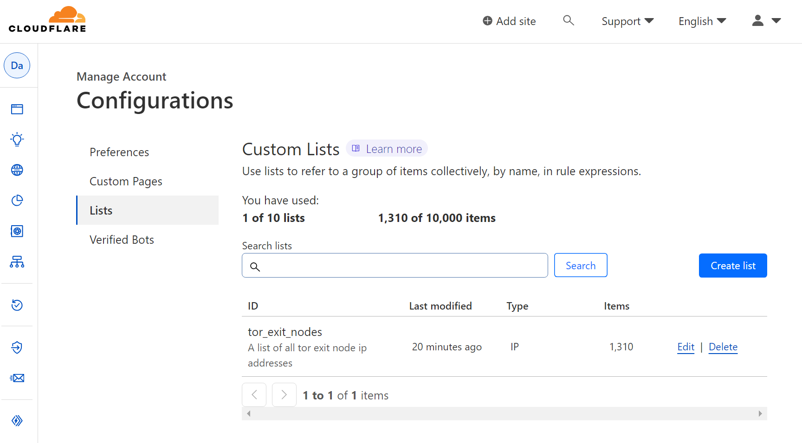
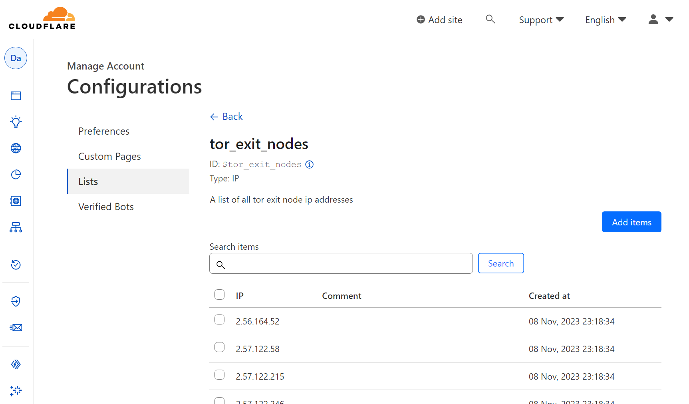
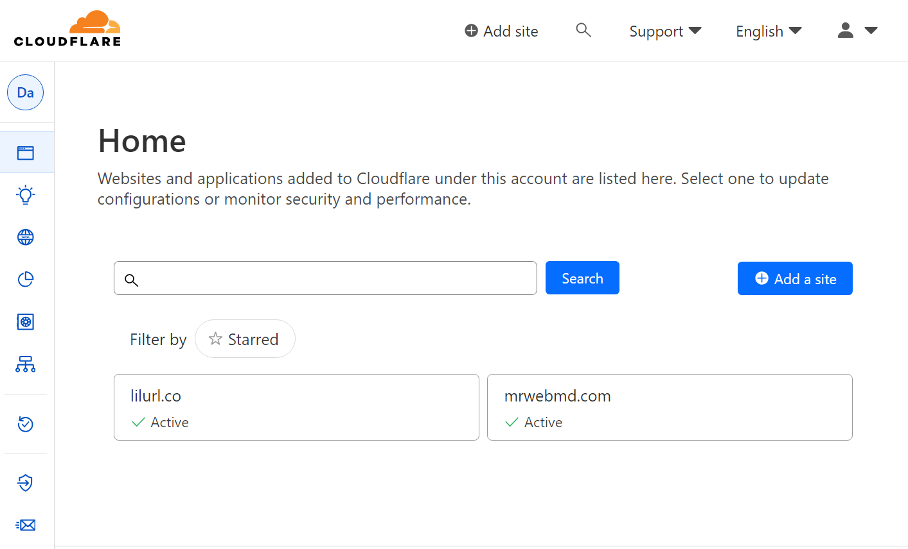
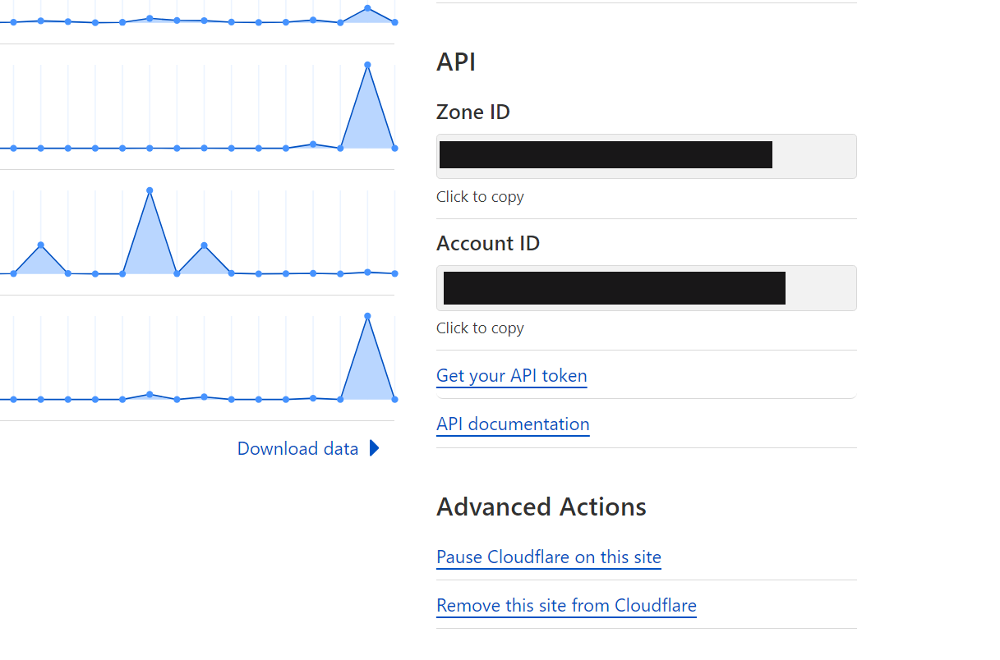
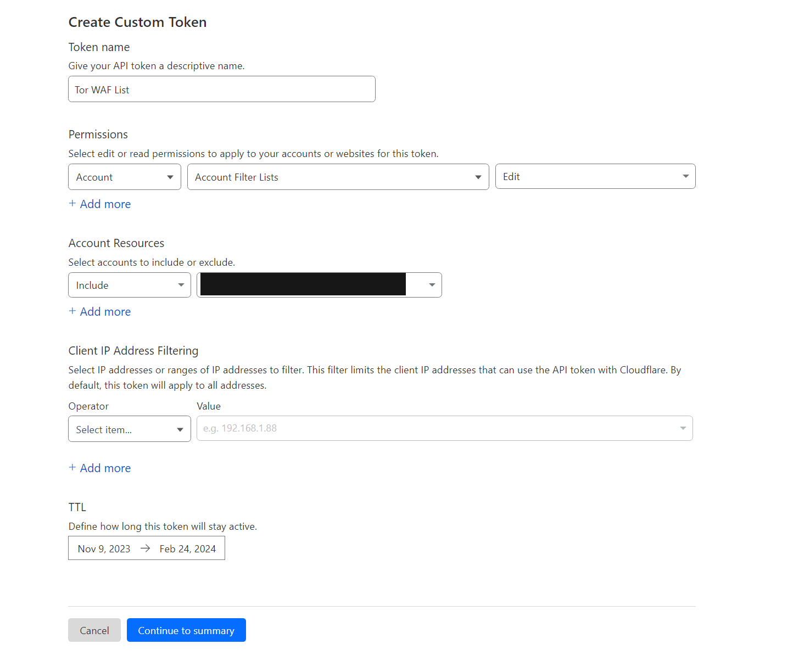
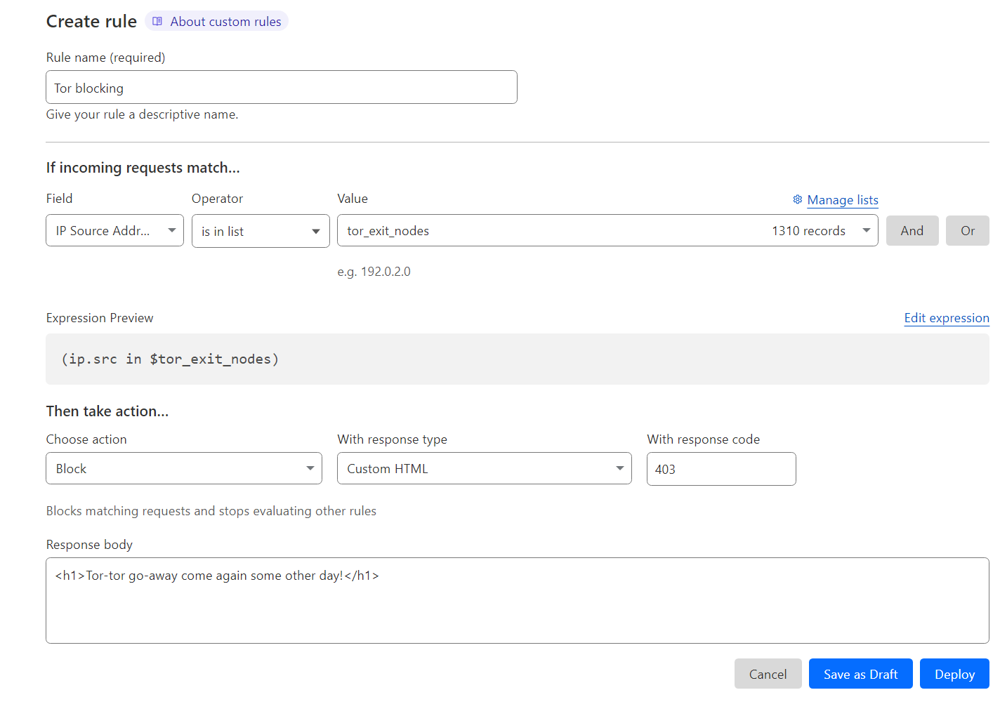
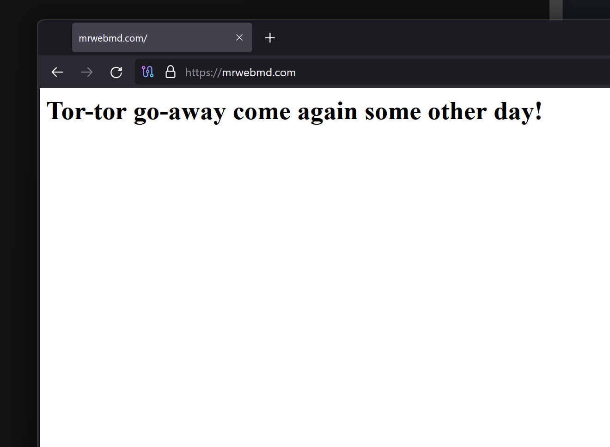

# Cloudflare TOR Firewall

## Overview

This projects goal is to help Cloudflare users block tor nodes using the Cloudflare Web Application Firewall (WAF).

It does this by fetching an updated list of tor exit nodes from [torproject.org](https://check.torproject.org/torbulkexitlist), and creating a [Cloudflare list](https://developers.cloudflare.com/waf/tools/lists/create-dashboard/) out of them. This new list can be used to create WAF rules which can block the exit nodes before they reach your website. Running this app multiple times will keep the exit node list updated within Cloudflare. The list provided by the tor project is not exhaustive, which means most but not all exit nodes will be blocked.





## Installation

### Download the project and install its dependencies.

```sh
git clone https://github.com/MrWebMD/cloudflare-tor-firewall
cd cloudflare-tor-firewall
yarn
```

Rename `.env.example` in the project root to `.env`

```sh
mv ./.env.example ./.env
```

To get started, the program needs two different environmental variables set in `.env`. Instructions for how to obtain each can be found below.

```
CF_API_KEY=
CF_ACCOUNT_ID=
```

## Usage

```sh
> yarn block
yarn run v1.22.19
warning package.json: No license field
$ ts-node index.ts
Tor exit node list is updating with 1310 addresses
Done in 2.43s.

```

## How to find your account id `(CF_ACCOUNT_ID)`

The `CF_ACCOUNT_ID` can be found by [logging into Cloudflare](https://dash.cloudflare.com/) and clicking on any website available on your dashboard.



The following page will contain your account id on the bottom right side. Copy your account id and paste it into the `.env` file.

```
CF_API_KEY=
CF_ACCOUNT_ID=YOUR_ACCOUNT_ID_HERE
```



## How to make an API key `(CF_API_KEY)`

1. Visit the [Api token page](https://dash.cloudflare.com/profile/api-tokens) in your Cloudflare account.

2. Click the "Create Token" button next to "API Tokens".

3. At the bottom of the page next to "Custom Token" click "Get Started".

4. You can choose any name for your API token like "Tor WAF List".

5. Under "Permissions", select "Account" for the first dropdown.

6. Select "Account Filter Lists" under the second dropdown.

7. Select "Edit" under the third drop down.

8. Under account resources choose "Include" for the first dropdown and select your account name for the second dropdown.

9. Keep "Client IP Address Filtering" blank. For the TTL choose the current date as your start date.

10. Choose 3 or 4 months from now as your end date. This is when the token will expire.

If all went well, your configuration should look like this:



Click "Continue to summary" then click "Create token". Copy your token and paste it in the `.env` file.

```
CF_API_KEY=YOUT_API_KEY_HERE
CF_ACCOUNT_ID=YOUR_ACCOUNT_ID_HERE
```

## How to make the WAF rule that uses the Tor exit node list

Once you get the app run correctly once, you'll have a new list within cloudflare.

[Log into Cloudflare](https://dash.cloudflare.com/) and choose the website which you want to block tor traffic on. On the left navigation sidebar click Security => WAF. On the new page, click "Create Rule". Now use the settings below to make use of the newly created Tor exit node list. Once your settings match the image above, click "Deploy"



## Example of the WAF rule in action


